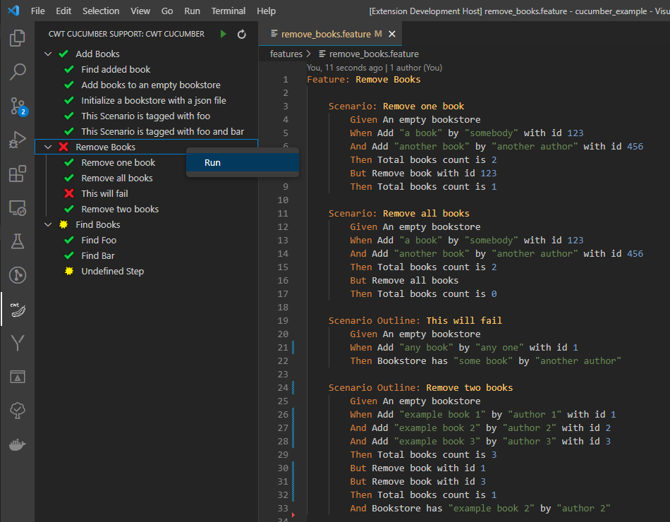
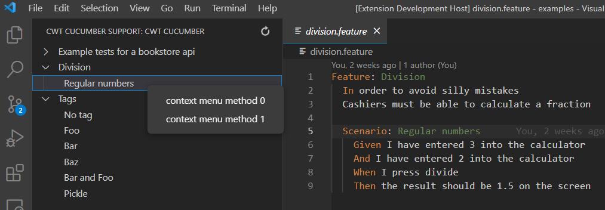
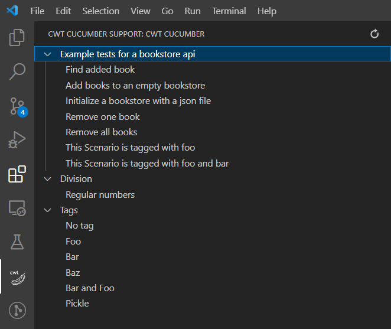

# CWT Cucumber Support

Let's create a tree view with vscode in TypeScript. In this project I'll start to implement a vscode extension which displays all your cucumber features and scenarios in a tree view.
  
On my blog you can find the articles to this repository:
-  <a href="https://www.codingwiththomas.com/blog/typescript-vs-code-api-lets-create-a-tree-view-part-3" target="_blank">VS-Code API: Let’s Create A Tree-View (Part 3)</a> 
-  <a href="https://www.codingwiththomas.com/blog/typescript-vs-code-api-lets-create-a-tree-view-part-2" target="_blank">VS-Code API: Let’s Create A Tree-View (Part 2)</a> 
-  <a href="https://www.codingwiththomas.com/blog/typescript-vs-code-api-lets-create-a-tree-view-part-1" target="_blank">VS-Code API: Let’s Create A Tree-View (Part 1)</a> 

## Part 3 (Final Part)
In my last part about TreeViews I implemented the icons with respect to their last test result. Where the green check means passed, the red cross means failed and the yellow splash means the test step is undefined (step not implemented). With the play butten we execute all tests or we use the context menu to run a single feature file or just a single scenario.

## Part 2 
Here I implemented `on_item_clicked(..)` to jump to the corresponding file and added a context menu to the tree view. There is no logic on the functions implemented yet, only two different logs, that we can see the functions are called accordingly. 

## Part 1
In the first article, the extention parses only feature files and creates a menu entry at the navigation bar: 

